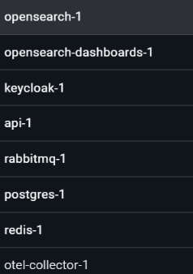

11. add audit service or module

Application map
performance monitoring
span traces agent  https://docs.opensearch.org/latest/observing-your-data/agent-traces/agent-tracing/

Query insights dashboards dashboard https://docs.opensearch.org/latest/observing-your-data/query-insights/query-insights-dashboard/

what about Trace Analytics in OpenSearch Dashboards
15. home page
12. monitoring ou observability service
16. easy to read volume names
17. add api documentation like swagger, put use other no him. and for graphql too.
18. auto dns subdomains
19.healthcheck status page alerting
 5. add item into basket use userID
 7. add a health check endpoint to all services
13. dark mode
14. set server timezone to UTC
 8. Rational Performance Tester
 3. why annoying json converter in basket/data
10. integracoes
Gateway de pagamento e antifraude
ERP
Emissão fiscal (NFe)
2. a schema per module and a dedicated database role.
Grant that role privileges only on its schema and set its default search path.
CREATE ROLE orders_role LOGIN PASSWORD 'orders_secret';
CREATE SCHEMA orders AUTHORIZATION orders_role;
GRANT USAGE ON SCHEMA orders TO orders_role;
GRANT SELECT, INSERT, UPDATE, DELETE ON ALL TABLES IN SCHEMA orders TO orders_role;
ALTER ROLE orders_role SET search_path = orders;
"Orders": "Host=localhost;Database=appdb;Username=orders_role;Password=orders_secret",
Transportadoras ou marketplaces

using System.Diagnostics;
using MediatR;
using Microsoft.Extensions.Logging;

namespace Shared.Behaviors;

/// 

/// A MediatR pipeline behavior that logs the start and end of request handling,
/// measures the time taken to handle the request and emits a warning when the
/// handling time exceeds a configured threshold.
/// 

/// <typeparam name="TRequest">The request type. Must implement <see cref="IRequest{TResponse}"/>.</typeparam>
/// <typeparam name="TResponse">The response type returned by the request handler.</typeparam>
public class LoggingBehavior<TRequest, TResponse>
  (ILogger<LoggingBehavior<TRequest, TResponse>> logger)
  : IPipelineBehavior<TRequest, TResponse>
  where TRequest : notnull, IRequest<TResponse>
  where TResponse : notnull
{
  /// 

  /// Handles the incoming request by:
  /// 1. Logging the start of handling with request metadata.
  /// 2. Measuring the time taken to invoke the next handler in the pipeline.
  /// 3. Logging a performance warning if handling takes longer than the threshold.
  /// 4. Logging the end of handling and returning the response.
  /// 

  /// <param name="request">The incoming request instance.</param>
  /// <param name="next">Delegate to the next handler in the pipeline.</param>
  /// <param name="cancellationToken">Cancellation token provided by MediatR.</param>
  /// <returns>The response returned by the next handler.</returns>
  public async Task<TResponse> Handle(TRequest request, RequestHandlerDelegate<TResponse> next, CancellationToken cancellationToken)
  {
    // Log only type metadata. Serializing the request can expose credentials,
    // payment details, request bodies, or other sensitive values to telemetry.
    logger.LogInformation(
        "[START] Handle request={Request} - Response={Response}",
            typeof(TRequest).Name, typeof(TResponse).Name);

    // Start a stopwatch to measure performance of the handler pipeline.
    Stopwatch timer = new ();
    timer.Start();

    // Invoke the next behavior/handler in the pipeline.
    // Note: MediatR's RequestHandlerDelegate does not accept a CancellationToken parameter here,
    // so cancellation must be observed inside the handler itself if required.
    TResponse response = await next();

    // Stop the timer and calculate elapsed time.
    timer.Stop();
    TimeSpan timeTaken = timer.Elapsed;

    // If the request took more than 3 seconds (using TotalSeconds for an accurate measurement),
    // log a performance warning to help identify slow handlers.
    if (timeTaken.TotalSeconds > 3)
    {
      logger.LogWarning(
          "[PERFORMANCE] The request {Request} took {TimeTakenSeconds} seconds.",
          typeof(TRequest).Name, timeTaken.TotalSeconds);
    }

    // Log the completion of request handling.
    logger.LogInformation("[END] Handled {Request} with {Response}", typeof(TRequest).Name, typeof(TResponse).Name);

    // Return the response from the handler pipeline.
    return response;
  }
}
