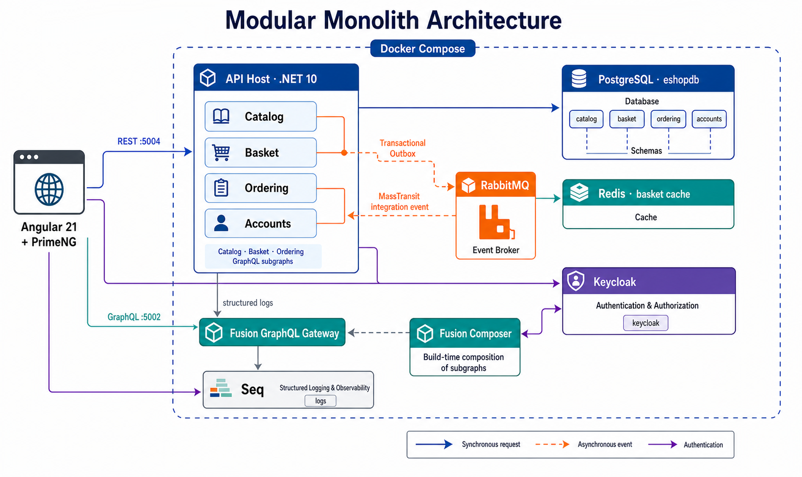
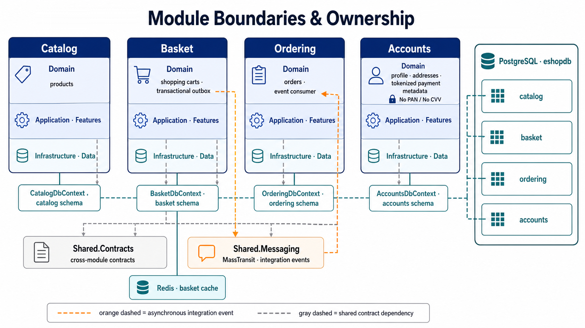
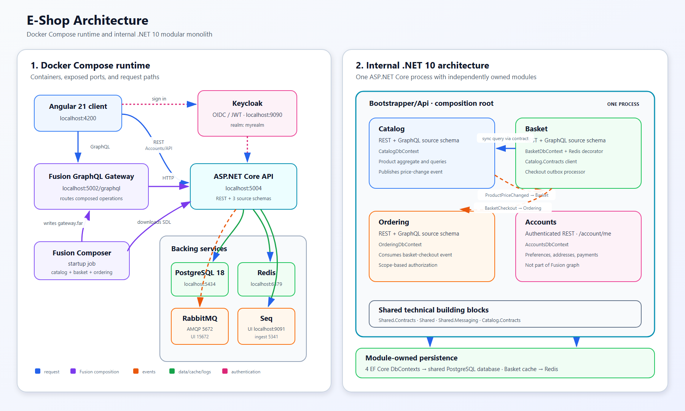

# .NET Modular Monolith E-Shop

This repository is a reference e-commerce application built as a **modular monolith on .NET 10**. Catalog, Basket, Ordering, and Accounts are independently structured business modules hosted in one ASP.NET Core process. An Angular client uses a Hot Chocolate Fusion gateway for the composed GraphQL API and calls selected REST endpoints on the API host.








The editable source for this diagram is [`architecture.svg`](architecture.svg).

## Architecture at a glance

### Docker Compose runtime

The Compose project in `src/` starts the following topology:

1. The **Angular 21** client authenticates users with Keycloak.
2. GraphQL requests go to the **Hot Chocolate Fusion gateway** at `http://localhost:5002/graphql`.
3. The gateway delegates fields to the Catalog, Basket, and Ordering source schemas hosted by the modular API.
4. REST requests, including the Accounts API, go directly to the API host at `http://localhost:5004`.
5. A short-lived **Fusion Composer** container downloads the three source schemas and generates `gateway.far` in a shared Docker volume before the gateway starts serving requests.
6. The API uses PostgreSQL, Redis, RabbitMQ, Keycloak, and Seq as backing services.

The composer is a startup job, not a long-running request-path service. If a source GraphQL schema changes, recreate the composer and gateway so the Fusion archive is regenerated.

### Internal .NET modules

`Bootstrapper/Api` is the composition root. It registers four modules in one ASP.NET Core host:

| Module | Public surface | Persistence | Responsibilities |
| --- | --- | --- | --- |
| Catalog | Carter REST endpoints and the `catalog` GraphQL schema | `CatalogDbContext` | Products, queries, and price-change events |
| Basket | Carter REST endpoints and the `basket` GraphQL schema | `BasketDbContext` plus Redis cache | Shopping carts, checkout, cache-aside access, and transactional outbox |
| Ordering | Carter REST endpoints and the `ordering` GraphQL schema | `OrderingDbContext` | Order creation, queries, and authorization policies |
| Accounts | Authenticated Carter REST endpoints under `/account/me` | `AccountsDbContext` | Customer preferences, saved addresses, and payment methods |

The contexts share one PostgreSQL server/database in this sample, but ownership remains inside each module. Accounts does not expose a GraphQL source schema and is therefore not included in the Fusion graph.

Shared projects are technical building blocks rather than business modules:

- `Shared.Contracts` contains CQRS abstractions used with MediatR.
- `Shared` contains common DDD types, validation/logging behaviors, EF Core interceptors, exceptions, pagination, and infrastructure extensions.
- `Shared.Messaging` contains integration-event contracts and MassTransit/RabbitMQ setup.
- `Catalog.Contracts` is Catalog's explicit in-process contract consumed by Basket.

Architecture tests enforce that business module assemblies do not directly depend on one another. The explicit Catalog contract is kept in a separate contracts assembly.

## Communication flows

### Synchronous communication

- Basket sends `GetProductByIdQuery`, defined by `Catalog.Contracts`, through the in-process MediatR pipeline before adding a product to a cart.
- The Fusion gateway routes a single client GraphQL operation across the Catalog, Basket, and Ordering source schemas over HTTP.
- Accounts operations use authenticated REST calls directly to the API host.

### Asynchronous communication

- When a Catalog product price changes, Catalog publishes `ProductPriceChangedIntegrationEvent` through MassTransit and RabbitMQ; Basket consumes it and updates matching cart items.
- Basket checkout stores `BasketCheckoutIntegrationEvent` in its outbox in the same database transaction. `OutboxProcessor` later publishes it to RabbitMQ; Ordering consumes it and creates the order.
- Domain events are dispatched in-process by the EF Core save-changes interceptor and MediatR.

## Patterns and technologies

- Modular monolith with enforced module boundaries
- Vertical Slice Architecture and feature folders
- Domain-Driven Design for aggregate and domain-event modeling
- CQRS with MediatR, FluentValidation, and pipeline behaviors
- EF Core code-first migrations with PostgreSQL
- Transactional outbox for reliable basket-checkout messaging
- Cache-aside repository decorator with Redis
- Event-driven integration with MassTransit and RabbitMQ
- REST endpoints with Carter and GraphQL with Hot Chocolate/Fusion
- OAuth 2.0/OpenID Connect and JWT bearer authentication with Keycloak
- Per-user and per-IP fixed-window rate limiting at the API and Fusion gateway
- Structured logging with Serilog and Seq
- Angular and PrimeNG client organized by bounded context

## Prerequisites

- Docker Desktop or another Docker Engine
- Docker Compose v2 (`docker compose version`)

The standard run and test workflows use containers. A local .NET SDK, Node.js,
PostgreSQL, Redis, RabbitMQ, and Keycloak installation is not required.

## Run with Docker Compose

All commands in this section run from the repository root.

### Start the application

```bash
docker compose -f src/docker-compose.yml -f src/docker-compose.override.yml up --build -d
```

The first startup can take a few minutes while Docker downloads images, builds
the API, gateway, and web client, imports the Keycloak realm, and composes the
Fusion gateway schema.

Check container status and follow startup logs:

```bash
docker compose -f src/docker-compose.yml -f src/docker-compose.override.yml ps
docker compose -f src/docker-compose.yml -f src/docker-compose.override.yml logs -f api fusion-composer graphql-gateway web-client
```

When `fusion-composer` exits with code `0`, schema composition completed
successfully. The other application containers should remain running.

### Stop or reset the application

Stop the application while retaining database and dependency volumes:

```bash
docker compose -f src/docker-compose.yml -f src/docker-compose.override.yml down
```

To perform a clean reset, including PostgreSQL data, installed web-client
packages, and the generated Fusion archive:

```bash
docker compose -f src/docker-compose.yml -f src/docker-compose.override.yml down --volumes
```

> `down --volumes` permanently removes local development data managed by this
> Compose project.

After changing a Dockerfile or project dependency, rebuild and restart the
affected services:

```bash
docker compose -f src/docker-compose.yml -f src/docker-compose.override.yml up --build -d
```

After changing a GraphQL source schema, recreate the composer and gateway:

```bash
docker compose -f src/docker-compose.yml -f src/docker-compose.override.yml up --force-recreate fusion-composer graphql-gateway
```

### Local service URLs

| Service | URL or port | Purpose |
| --- | --- | --- |
| Angular client | <http://localhost:4200> | Browser application |
| Fusion GraphQL gateway | <http://localhost:5002/graphql> | Composed Catalog, Basket, and Ordering graph |
| Modular API | <http://localhost:5004> | REST API and source GraphQL schemas |
| Catalog source schema | <http://localhost:5004/graphql/catalog> | Catalog GraphQL endpoint |
| Basket source schema | <http://localhost:5004/graphql/basket> | Basket GraphQL endpoint |
| Ordering source schema | <http://localhost:5004/graphql/ordering> | Ordering GraphQL endpoint |
| Keycloak | <http://localhost:9090> | Identity provider (`eshoprealm`) |
| Seq | <http://localhost:9091> | Structured-log UI |
| RabbitMQ management | <http://localhost:15672> | Broker administration UI |
| PostgreSQL | `localhost:5434` | Development database |
| Redis | `localhost:6379` | Distributed basket cache |

The sample Compose credentials for PostgreSQL and RabbitMQ are `eshopdb` / `eshopdb`. They are development-only values and must not be reused in production.

## Test with Docker

Run the .NET test suite in the .NET 10 SDK container:

```bash
docker run --rm -v "${PWD}/src:/workspace" -w /workspace mcr.microsoft.com/dotnet/sdk:10.0 dotnet test eshop-modular-monilith.slnx
```

Run the Angular boundary check and production build using the Compose web-client
service and its Node.js image:

```bash
docker compose -f src/docker-compose.yml -f src/docker-compose.override.yml run --rm --no-deps web-client sh -c "npm install && npm run check:boundaries && npm run build"
```

These commands mount the working tree, so test and compiler artifacts may be
created under `src/`.

## Optional local development

If you prefer to run processes outside containers, install the .NET 10 SDK and
a Node.js version compatible with Angular 21. Start the infrastructure with
Compose, then run the API and client from separate terminals:

```bash
dotnet run --project src/Bootstrapper/Api/Api.csproj

cd src/web-client
npm ci
npm start
```

The full Compose workflow remains necessary to generate and run the Fusion
gateway archive automatically. Client configuration targets the API, gateway,
and Keycloak ports listed above.

## Authentication and authorization

Compose imports `src/docker-config/keycloak/eshoprealm-realm.json` into Keycloak. Both the API and Fusion gateway validate Keycloak JWT bearer tokens, and the gateway forwards the caller's `Authorization` header to source schemas. Ordering applies scope-based authorization policies, while Accounts and user-owned Basket operations derive the customer identity from token claims.

## Rate limiting

The API and Fusion gateway each enforce an independent, process-local fixed-window limit. The default is 60 requests per 60 seconds with no queue. Authenticated requests are grouped by the JWT `sub` claim; anonymous requests fall back to the connection IP address. Every request counts, including CORS preflight, schema downloads, health checks, rejected authorization attempts, and each API source request generated by a Fusion operation.

Excess requests return HTTP `429 Too Many Requests` as `application/problem+json` and include `Retry-After` when retry metadata is available. Configure each host with `RateLimiting:PermitLimit` and `RateLimiting:WindowSeconds`, or environment variables such as `RateLimiting__PermitLimit`. Because counters are held in memory, each application replica maintains its own quota.

## Project structure

```text
src/
|-- Bootstrapper/
|   |-- Api/                  # Modular-monolith composition root
|   `-- Gateway/              # Hot Chocolate Fusion gateway
|-- Modules/
|   |-- Accounts/
|   |-- Basket/
|   |-- Catalog/
|   `-- Ordering/
|-- Shared/                   # Shared contracts and infrastructure
|-- Tests/                    # Unit and architecture tests
|-- web-client/               # Angular/PrimeNG application
|-- docker-config/            # PostgreSQL, Keycloak, and Fusion setup
`-- docker-compose*.yml
```
