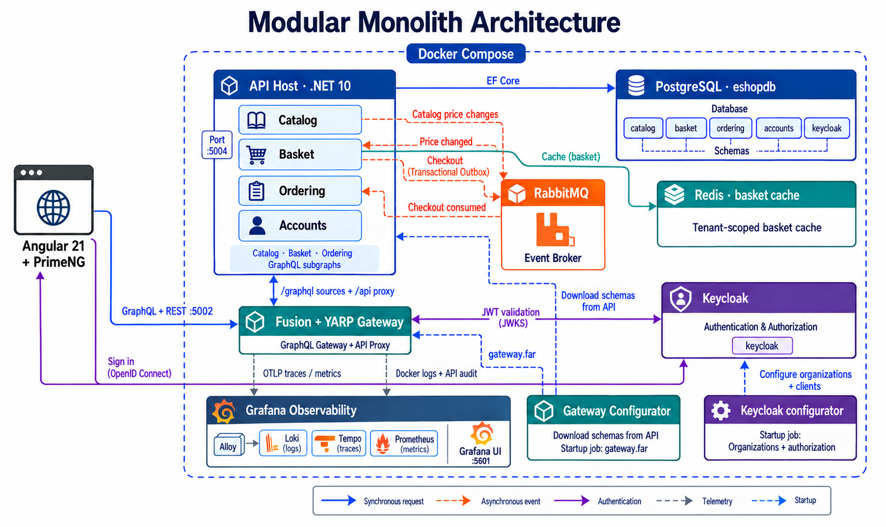

# Introduction

E-Shop is a reference e-commerce application and learning companion for a .NET 10 modular monolith. Catalog, Basket, Ordering, and Accounts run in one ASP.NET Core API process while retaining ownership of their business models, handlers, persistence, and authorization rules.

The Angular 21 / PrimeNG client uses a separate Hot Chocolate Fusion gateway for composed GraphQL operations and its authenticated YARP `/api` proxy for REST. Keycloak provides identity and organization-based tenancy. PostgreSQL stores module-owned schemas, Redis caches baskets, and RabbitMQ carries integration events through MassTransit.

## What the sample demonstrates

- Feature-oriented vertical slices with CQRS, MediatR, FluentValidation, and Mapperly DTO mapping.
- Explicit module contracts and architecture tests that prevent implementation dependencies between business modules.
- Tenant-aware persistence, caching, authorization, and message processing.
- A transactional Basket checkout outbox consumed by Ordering, plus Catalog price-change events consumed by Basket.
- Independent API/gateway rate limits, structured logging, API audit records, and Alloy collection into Loki, Tempo, and Prometheus with Grafana exploration.

Start with [Getting Started](getting-started.md), then read the [architecture guide](architecture.md). The repository demonstrates implemented application behavior; it does not provide a RAD code generator.
