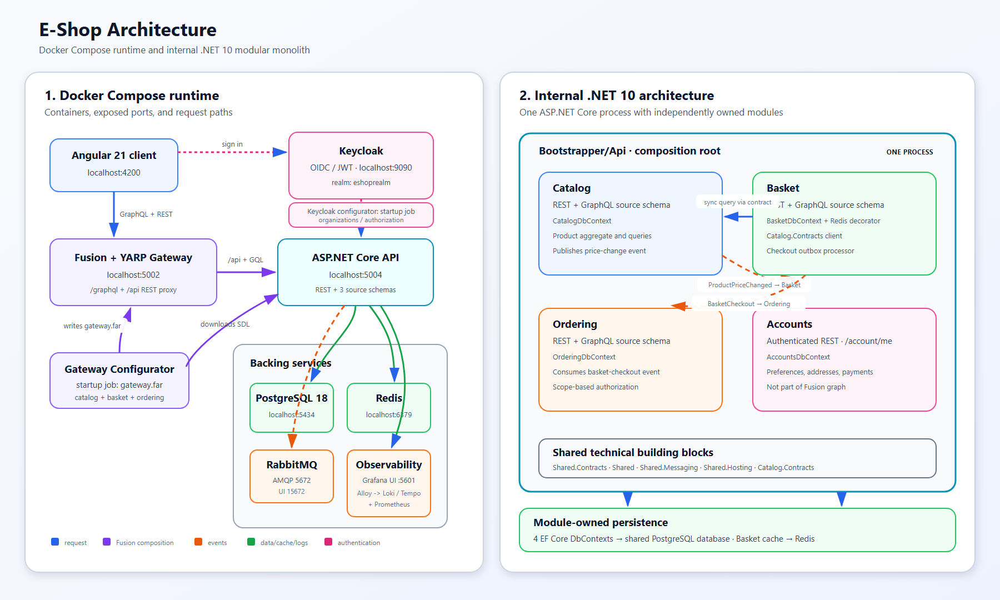

# EShop observability stack

The production Compose project uses a single-host Grafana stack built from
separate, pinned services:

```text
API / Gateway OTLP traces + metrics -> Alloy -> Tempo / Prometheus
API / Gateway Docker JSON stdout   -> Alloy -> Loki
API audit NDJSON files             -> Alloy -> Loki
Tempo span metrics + service graph -------> Prometheus
Grafana ---------------------------> Loki / Tempo / Prometheus
```

Grafana Alloy is the only collection agent. This keeps the deployment small
without losing Docker discovery, persisted file positions, tail sampling, host
metrics, container metrics, or cross-signal correlation. The routing follows
the signal separation used by `grafana/docker-otel-lgtm`, while Docker
discovery and operational views follow the useful parts of OIB. Unlike those
demo-oriented projects, this stack is separated into persistent services and
does not collect every container by default.

The deployment intentionally has no Kafka, object store, reverse proxy, or
backend authentication. It is designed for one Linux VPS. Grafana must be
reached through an existing TLS ingress, VPN, or SSH tunnel; that boundary is
outside this Compose project.

## Architecture diagram



[Editable SVG](../../../architecture.svg). API/gateway traces and metrics use OTLP; Docker application logs and API audit files are collected separately. Grafana issues queries to the three stores; Tempo sends generated span metrics and service graphs to Prometheus. Regenerate the diagrams from the repository root with `powershell -NoProfile -ExecutionPolicy Bypass -File scripts/generate-readme-diagrams.ps1 -PreserveExisting`.

## Versions, storage, and retention

| Component | Version | Volume | Retention |
| --- | --- | --- | --- |
| Grafana | 13.2.0 | `grafana_data` | Persistent users and UI state |
| Alloy | 1.18.0 | `alloy_data` | Docker/file positions and remote-write WAL |
| Loki | 3.7.7 | `loki_data` | Application 15 days; audit streams 60 days |
| Tempo | 3.0.3 | `tempo_data` | Traces 15 days |
| Prometheus | 3.14.0 | `prometheus_data` | 30 days or 10 GB, whichever is reached first |

The previous OpenSearch named volume is deliberately absent from active
Compose configuration. Compose does not delete that existing Docker volume
during this migration. Keep it until the migration has been verified and its
data is no longer needed; do not run `docker compose down --volumes` against an
old project if that data must be retained.

## Production configuration and startup

From `src/`, create the environment file and replace the examples:

```powershell
Copy-Item .env.observability.example .env
```

`GRAFANA_ADMIN_USER` and `GRAFANA_ADMIN_PASSWORD` are required. Compose has no
password fallback, Grafana sign-up and anonymous access are disabled, and no
Loki, Tempo, or Prometheus host port is published. Set `DOCKER_GID` to the
numeric Docker group on the Linux host:

```bash
getent group docker
```

On Docker Desktop, the socket inside its Linux VM is normally owned by
`root:root`; set `DOCKER_GID=0`. You can verify the numeric owner without
granting Alloy extra privileges:

```powershell
docker compose run --rm --no-deps --user 0:0 --entrypoint /usr/bin/stat alloy -c "%u:%g %a" /var/run/docker.sock
```

Validate and start:

```bash
docker compose -f docker-compose.yml -f docker-compose.override.yml config --quiet
docker compose -f docker-compose.yml -f docker-compose.override.yml up -d --build
docker compose -f docker-compose.yml -f docker-compose.override.yml ps
```

Only these observability listeners are host-published, all on loopback:

| Listener | Address | Purpose |
| --- | --- | --- |
| Grafana | `127.0.0.1:5601` | Authenticated UI |
| Alloy OTLP/gRPC | `127.0.0.1:4317` | Local non-Compose OTLP clients |
| Alloy OTLP/HTTP | `127.0.0.1:4318` | Local non-Compose OTLP clients |
| Alloy diagnostics | `127.0.0.1:12345` | Component graph and collector metrics |

Application containers use `http://alloy:4317` internally. `OpenTelemetry__ExportLogs`
is `false` for API and Gateway because Alloy reads those same JSON events from
Docker stdout. Traces and metrics remain enabled. Outside Compose,
`OpenTelemetry:ExportLogs` defaults to `true` for backward compatibility.

All containers use Docker's bounded `local` logging driver (10 MB per file,
five files). This temporary stdout history is independent of Loki retention and
cannot grow without bound.

## Automatic Docker log collection

Alloy watches the Docker API through a read-only socket and retains read
positions in `alloy_data`. A container is collected only when it carries this
label:

```yaml
labels:
  observability.logs: "true"
  observability.service_name: my-service
  observability.environment: Production
```

API and Gateway are initially labeled. Adding the same labels to a newly
deployed container makes it observable without adding another exporter or
changing Alloy. Unlabeled containers are ignored. JSON console fields are
parsed into severity/category labels and structured metadata for trace, span,
route, status, duration, path, method, and scopes; a plain-text line remains
searchable as-is.

The Docker socket and Docker group are security-sensitive and effectively
grant host-level control. Alloy nevertheless runs as its dedicated UID/GID,
without privileged mode, with all Linux capabilities dropped and
`no-new-privileges`. Host data mounts are read-only except `/var/run`.

This least-privilege profile intentionally limits the embedded cAdvisor
exporter to container CPU, memory, network, and OOM signals; container-layer
filesystem traversal is disabled. Host filesystem capacity and the 70/80/85%
disk alerts come from Alloy's Unix exporter. Run the stack only inside the
dedicated VPS trust boundary and treat membership in the Docker group as root-
equivalent access.

## Audit ingestion guarantees

The API continues to append camel-case NDJSON to the shared `audit_logs`
volume. Alloy mounts that volume read-only and persists its file cursor.

The pipeline:

- drops malformed JSON, records without `eventId`, and records whose
  `occurredAtUtc` is not a valid RFC 3339 timestamp;
- uses `occurredAtUtc` as the Loki timestamp;
- applies only the low-cardinality `log_type=audit` stream classification plus
  service and environment context;
- stores event, actor, tenant, trace, span, and correlation IDs as structured
  metadata instead of stream labels.

Ingestion is append-only. Reusing an `eventId` does not overwrite a previous
event. The Audit Explorer includes a repeated-ID table to surface identical
replays and different events that share an ID.

Malformed audit records are intentionally counted by
`loki_process_dropped_lines_total` with reason
`audit_invalid_json_or_missing_event_id`. Review that counter during audit
producer changes. The audit file remains the local source of truth until it is
rotated by the application; Loki is an operational search copy, not a legally
immutable archive.

## Sampling and correlation

Alloy holds traces for ten seconds and retains:

- every trace with OpenTelemetry error status;
- every trace lasting at least two seconds;
- the configured probabilistic baseline.

Set `OTEL_TAIL_SAMPLING_PERCENTAGE=100` while commissioning and reduce it for
normal production traffic. Errors and slow traces are retained independently
of the baseline.

Tempo generates span metrics, service graphs, and exemplars and remote-writes
them to Prometheus. Provisioned stable data source UIDs implement Loki-to-Tempo
trace links, Tempo-to-Loki log links, Prometheus exemplar links, and Tempo
service/node graphs backed by Prometheus.

Provisioned, immutable dashboards are under `grafana/dashboards/`:

- EShop Overview and RED Metrics;
- EShop Event / Log Explorer;
- EShop Trace Explorer;
- EShop Service Dependencies;
- EShop Audit Explorer;
- EShop Stack Health and VPS Resources.

Prometheus rules surface application trace errors, unavailable targets, Alloy
ingestion failures, container restarts and resource pressure, plus disk usage
at 70%, 80%, and 85%. They appear in Grafana without an external notification
integration.

## Backup and restore runbook

Local volumes share the VPS failure domain. Production therefore requires
encrypted provider snapshots and at least one encrypted off-host backup. Do
not store provider credentials in this repository.

Required schedule:

- one encrypted snapshot every day, retaining seven daily snapshots;
- one encrypted snapshot every week, retaining four weekly snapshots;
- an off-host encrypted backup after material configuration changes and at
  least weekly;
- a restore exercise into a clean Compose project every quarter.

For a consistent backup, stop writers gracefully before the snapshot:

```bash
docker compose stop api graphql-gateway alloy tempo loki prometheus grafana
# Trigger the provider snapshot and/or volume backup here.
docker compose start loki tempo prometheus grafana alloy api graphql-gateway
docker compose ps
```

If a crash-consistent provider snapshot is the only supported mode, document
that limitation and verify Loki, Tempo, and Prometheus on every restore test.

Quarterly restore procedure:

1. Create a clean VPS or isolated Compose project; never restore over the live
   volumes.
2. Restore the encrypted snapshot or the five observability volume backups.
3. Copy the same reviewed Compose configuration and supply fresh Grafana
   credentials through the environment.
4. Start `observability-volume-init`, then Loki, Tempo, Prometheus, Grafana, and
   Alloy.
5. Confirm all health states, open each dashboard, query telemetry older than
   the restore time, and check Grafana users/provisioning.
6. Send a labeled test-container log, one OTLP trace/metric, and a valid audit
   record; verify cross-signal links and continued ingestion without replay.
7. Record the restore date, backup identifier, recovery duration, checks, and
   operator sign-off outside the repository; destroy the isolated restore only
   after evidence is retained.

## Commissioning checks

Before production cutover:

1. Run Compose config validation and the native config validators from the
   pinned Alloy, Loki, Tempo, and Prometheus images.
2. Verify the only observability host ports are `5601`, `4317`, `4318`, and
   `12345`, all bound to `127.0.0.1`.
3. Start with empty LGTM volumes and wait for every long-running service to be
   healthy; confirm no Kafka or reverse-proxy container exists.
4. Send one API/Gateway request and confirm exactly one Loki event while the
   same event remains visible in `docker logs`.
5. Start one labeled and one unlabeled test container; only the labeled log may
   appear. Restart Alloy and verify its Docker/audit cursors continue without
   unwanted replay.
6. Generate successful, failed, and two-second requests and verify logs,
   traces, RED metrics, exemplars, service graphs, and bidirectional links.
7. Exercise valid, malformed, missing-ID, invalid-time, exact-replay, and
   differing-same-ID audit inputs.
8. Exercise Prometheus alerts, including the three filesystem thresholds, and
   inspect host/container metrics.
9. Restart the complete stack and confirm telemetry and dashboards persist.
10. Complete and record the first clean-project snapshot restore before
    declaring the migration finished.
